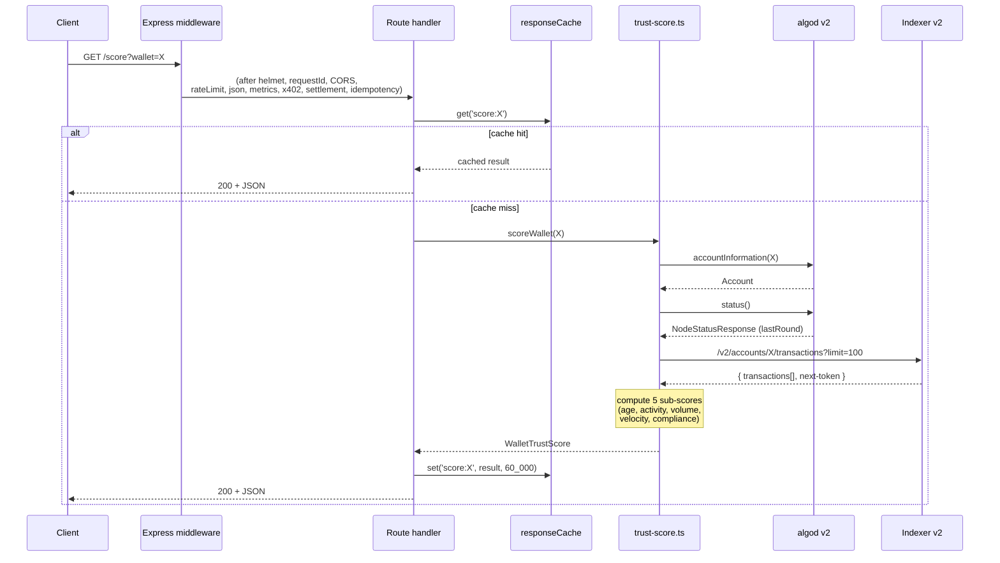
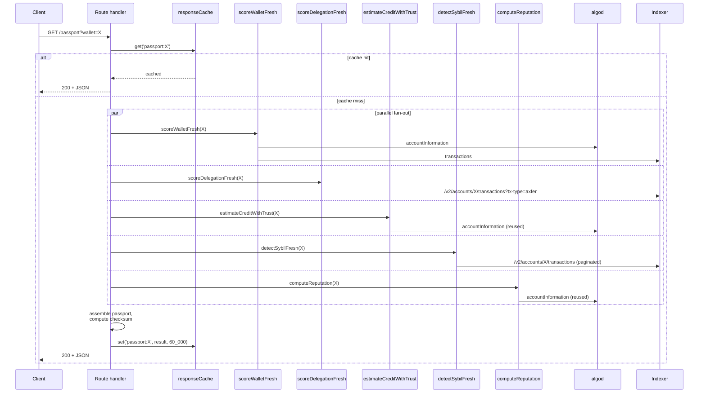
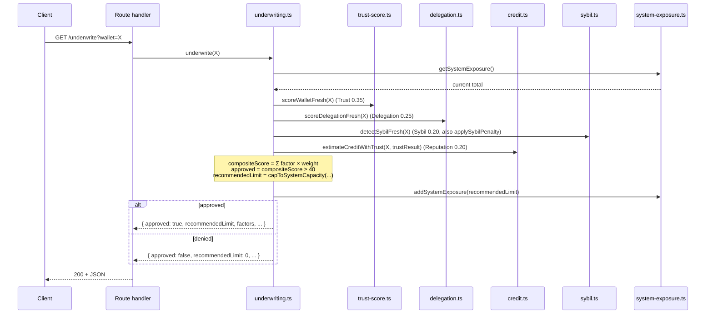
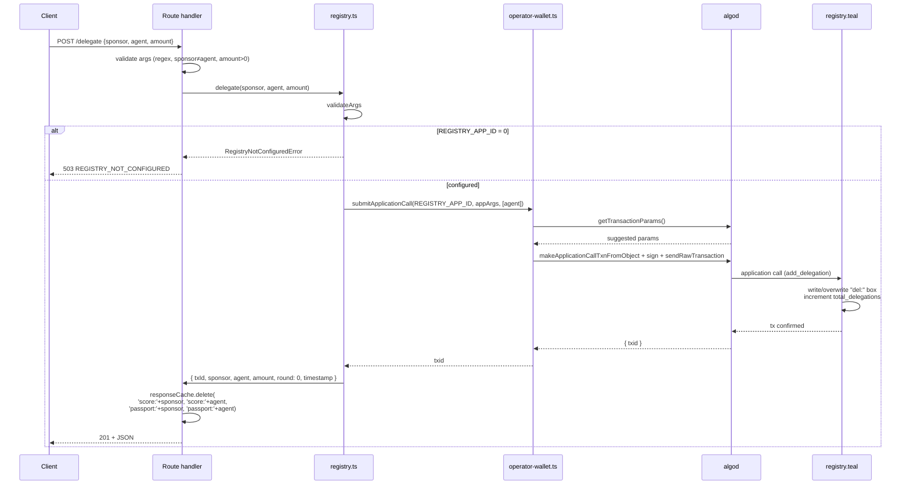

# Data Flow

Sequence diagrams for the four most representative endpoints.

## 1. `GET /score?wallet=X`

**Algorand round-trips:** 2 (algod) + 1 (indexer) = 3.
**Cache TTL:** 60 s.

## 2. `GET /passport?wallet=X`

The passport fan-out is the most I/O-heavy path. It calls five
sub-systems and bypasses the per-wallet LRU caches for guaranteed
freshness.

**Algorand round-trips:** 2 (algod) + 4-6 (indexer, paginated) = 6-8.
**Cache TTL:** 60 s. The response cache short-circuits repeat
requests entirely.

The passport document carries a tamper-evident SHA-256
`checksum` field — see [../concepts/passport-document.md](../concepts/passport-document.md).

## 3. `GET /underwrite?wallet=X`

**Algorand round-trips:** 2 (algod) + 4-6 (indexer) = 6-8.
**State writes:** `data/system-exposure.json` (synchronous).

The underwriting decision uses the **non-fresh** variants in
`underwrite()` (`scoreWallet`, `scoreDelegation`, `detectSybil`)
plus `estimateCreditWithTrust` — see
[../concepts/credit-and-underwriting.md](../concepts/credit-and-underwriting.md).

## 4. `POST /delegate`

**Algorand round-trips:** 2 (algod) + 1 (stateful call) = 3.
**Idempotency:** `Idempotency-Key` header recommended; replays
return the cached response within 24 h.

See [../architecture/smart-contracts.md](../architecture/smart-contracts.md)
for the on-chain encoding details.
