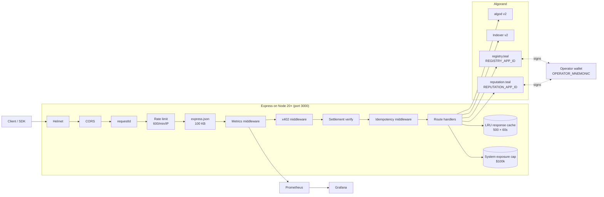
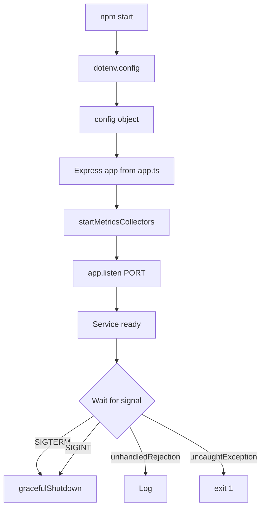

# System Design

This is the canonical system-design document for Agent Passport. It
replaces the legacy `docs/ARCHITECTURE.md` stand-in, which described a
pre-x402, pre-contracts, pre-SDK version of the service.

## 1. System Overview

Agent Passport is a **stateless HTTP API** that scores Algorand
wallets for trust, delegation trust, sybil risk, reputation, and
creditworthiness, and exposes two on-chain mutating endpoints
(`/delegate`, `/revoke`) backed by a TEAL stateful contract.



**Key properties**

- **Stateless.** Every request fetches data from Algorand; only
  `data/rate-limit.json` and `data/system-exposure.json` are persisted
  to disk.
- **Horizontally scalable.** Add pods behind a load balancer; the only
  multi-replica caveat is the in-memory idempotency store, which needs
  Redis for shared state (see
  [../operations/idempotency.md](../operations/idempotency.md)).
- **Hot-reloadable.** `npm run dev` uses `tsx watch`; typecheck via
  `npm run typecheck`; lint via `npm run lint`.
- **Production-shaped observability.** 38 Prometheus metrics, 24+
  alert rules, 17-panel Grafana dashboard, 8 runbooks.

## 2. Request Lifecycle (for `/score`)

```
Client                    Express middleware                 Algorand
  │                              │                              │
  │  GET /score?wallet=X         │                              │
  │─────────────────────────────▶│                              │
  │                              │  helmet (security headers)   │
  │                              │  requestId (UUID + log)      │
  │                              │  CORS                        │
  │                              │  rateLimit (600/min/IP)      │
  │                              │  express.json                │
  │                              │  metrics                     │
  │                              │  x402 (off by default)       │
  │                              │  settlement (off)            │
  │                              │  idempotency                 │
  │                              │  route handler               │
  │                              │  - cache.get('score:X')?     │
  │                              │  - accountInformation(X)────▶│
  │                              │  ◀──── Account ──────────────│
  │                              │  - indexer /transactions────▶│
  │                              │  ◀──── txns[] ───────────────│
  │                              │  [compute 5 sub-scores]      │
  │                              │  [classify risk + limit]     │
  │                              │  [generate explanation]      │
  │                              │  cache.set('score:X', r)     │
  │  200 + JSON                  │                              │
  │◀─────────────────────────────│                              │
```

See [data-flow.md](data-flow.md) for the `/passport`, `/underwrite`,
and `/delegate` flows.

## 3. Middleware Stack

Middleware is registered in this order in `src/app.ts`. Each is
covered in detail in [middleware-stack.md](middleware-stack.md).

| # | Middleware | Source | Purpose |
|---|------------|--------|---------|
| 1 | `app.set('trust proxy', 1)` | `src/app.ts:30` | Honour `X-Forwarded-For` from one hop of LB |
| 2 | `helmet()` | `src/app.ts:33` | Security headers (HSTS, CSP, X-Content-Type-Options) |
| 3 | `requestIdMiddleware` | `src/lib/security.ts:171` | UUID per request, surfaced via `X-Request-ID` |
| 4 | `requestLoggingMiddleware` | `src/lib/security.ts:191` | Structured log line with requestId + clientIp |
| 5 | `corsMiddleware({ origin })` | `src/lib/security.ts:137` | CORS with single-value origin validation |
| 6 | `rateLimiter({ windowMs: 60_000 })` | `src/lib/security.ts:68` | 600 req/min/IP (configurable); bypasses for ops + trusted IPs |
| 7 | `express.json({ limit: '100kb' })` | `src/app.ts:42` | Body parser with payload-based DoS guard |
| 8 | `metricsMiddleware` | `src/lib/metrics.ts` | Records `agent_passport_http_*` metrics |
| 9 | `x402Middleware` | `src/lib/x402.ts:47` | x402 paywall (off by default) |
| 10 | `settlementVerificationMiddleware` | `src/lib/x402.ts:97` | Asynchronous on-chain settlement check |
| 11 | `idempotencyMiddleware` | `src/lib/idempotency.ts:111` | `Idempotency-Key` replay + conflict detection |
| 12 | route handlers | `src/app.ts:86+` | See [../api/README.md](../api/README.md) |

The order is significant: metrics wrap everything, x402 and
settlement verify come **before** idempotency so paid-then-replayed
requests are charged only once, and rate limiting is **after** CORS
so CORS preflight never counts against a budget.

## 4. Algorand Data Sources

The service reads from two Algorand APIs and (optionally) writes to
two stateful contracts.

| Source | Default URL | Auth | Used for |
|--------|-------------|------|----------|
| algod v2 | `https://testnet-api.algonode.cloud:443` | Optional token | `accountInformation`, `status`, `getTransactionParams`, `sendRawTransaction` |
| Indexer v2 | `https://testnet-idx.algonode.cloud:443` | Optional token | `/v2/accounts/{wallet}/transactions` (paginated, with `next-token`) |
| `registry.teal` | App ID set by `REGISTRY_APP_ID` | Operator-signed | `add_delegation`, `revoke_delegation`, `check_delegation`, `get_delegations` |
| `reputation.teal` | App ID set by `REPUTATION_APP_ID` | Operator-signed | `record(wallet, event_type, amount)` |

All data sources are configurable via env vars — see
[../operations/environment-variables.md](../operations/environment-variables.md).

## 5. Caching Architecture

Three distinct caches live in the service. See
[caching.md](caching.md) for details.

| Cache | Where | Max size | TTL | Invalidation |
|-------|-------|---------:|-----|--------------|
| Response cache | `src/app.ts:27` (`responseCache`) | 500 entries | 60s | `/delegate`, `/revoke`, `/reputation/record` invalidate affected wallets |
| Per-wallet account-info caches | `src/trust-score.ts:244`, `src/sybil.ts`, `src/trust-graph.ts`, `src/delegation.ts` | 200 entries each | 60s | TTL only |
| Idempotency store | `src/lib/idempotency.ts:21` | 10 000 entries | 24h | TTL only + 5-min sweeper |

The response cache is exposed as `agent_passport_cache_*` metrics.

## 6. Module Map

See [module-reference.md](module-reference.md) for a one-section-per-
file reference. High-level responsibilities:

| File | One-liner |
|------|-----------|
| `src/index.ts` | Bootstrap, graceful shutdown, signal handling |
| `src/app.ts` | Express app, all routes, middleware order |
| `src/config.ts` | Env-var parsing and validation |
| `src/trust-score.ts` | Composite trust score (5 sub-scores) |
| `src/delegation.ts` | Delegation trust graph |
| `src/sybil.ts` | Sybil detection (12 signals) |
| `src/credit.ts` | Credit capacity estimation |
| `src/underwriting.ts` | Decision engine (4 factors + system exposure) |
| `src/reputation.ts` | On-chain reputation events |
| `src/passport.ts` | Passport document generation + checksum |
| `src/trust-graph.ts` | Trust graph analytics, exposure, what-ifs |
| `src/counterparty.ts` | Merchant counterparty check |
| `src/registry.ts` | On-chain `/delegate` and `/revoke` |
| `src/lib/algorand-client.ts` | Shared `algod` SDK client |
| `src/lib/cache.ts` | `LRUCache<T>` class |
| `src/lib/constants.ts` | Wallet regex, network constants, x402 pricing |
| `src/lib/graph.ts` | Pure-math graph algorithms (4 signals) |
| `src/lib/idempotency.ts` | `Idempotency-Key` middleware + store |
| `src/lib/logger.ts` | Structured JSON logger |
| `src/lib/metrics.ts` | 38 Prometheus metrics + middleware |
| `src/lib/metrics-collectors.ts` | Process / uptime gauges (15s interval) |
| `src/lib/operator-wallet.ts` | Operator wallet init + tx submission |
| `src/lib/security.ts` | Rate limit, CORS, requestId, request logging |
| `src/lib/system-exposure.ts` | `MAX_SYSTEM_EXPOSURE = 100_000`, cap math |
| `src/lib/timeout.ts` | `withTimeout`, `fetchWithTimeout` |
| `src/lib/x402.ts` | x402 middleware + settlement verification |

## 7. Configuration Bootstrap and Graceful Shutdown

### Bootstrap (`src/index.ts`)



### Graceful shutdown

`gracefulShutdown` is called on `SIGTERM` and `SIGINT`. The flow:

1. `app.stopMetricsCollectors()` (registered via `process.once` in `app.ts`)
2. `server.close()` — drains in-flight HTTP requests
3. After 10 s, `process.exit(1)` (forced) — see
   [../operations/graceful-shutdown.md](../operations/graceful-shutdown.md)
4. `unhandledRejection` is logged, not exited
5. `uncaughtException` is logged and `process.exit(1)`

## 8. Storage and Persistence

| Path | Format | Owner | Purpose |
|------|--------|-------|---------|
| `data/rate-limit.json` | `{ ip: { count, resetAt } }` | `src/lib/security.ts:48` | Persist rate-limit state across restarts |
| `data/system-exposure.json` | `{ total, updatedAt }` | `src/lib/system-exposure.ts:50` | Persist cumulative system exposure |
| `dist/` | Compiled JS | `tsc` | Build output (gitignored) |
| `node_modules/` | npm | `npm install` | Dependencies (gitignored) |
| `coverage/` | lcov + html | `vitest run --coverage` | Coverage report (gitignored) |

The service has **no database**, no message queue, and no shared
cache. All runtime data comes from Algorand; all transient data
lives in process memory or the two JSON files above.

## 9. Concurrency, Threading, and Memory Model

- **Single-threaded event loop** (Node.js). The service is
  CPU-light and I/O-heavy; the bottleneck is Algorand RPC latency,
  not the service itself.
- **Synchronous persistence.** Both JSON files are written
  synchronously via `fs.writeFileSync`; writes are rare (every 100
  rate-limit hits per client, on every system-exposure change) and
  short. Disk I/O is not a bottleneck.
- **In-memory stores.** The idempotency store, LRU cache, and
  per-wallet caches are all in-process. They survive process
  restarts only if the env var enables a persistence file.

## 10. Security Model

The security model has six layers, each documented in
[../security/threat-model.md](../security/threat-model.md):

1. **Input validation** — `WALLET_REGEX`, 100 KB body limit, 30 s
   request timeout, Zod schemas (where used)
2. **Rate limiting** — 600 req/min/IP, with bypass lists for ops
   and trusted IPs; persisted to `data/rate-limit.json`
3. **Idempotency** — 24h TTL, body-hash dedup, 409 on mismatch
4. **System exposure cap** — `MAX_SYSTEM_EXPOSURE = 100_000`,
   persisted to `data/system-exposure.json`
5. **x402 payment verification** — replay protection, settlement
   verification against the facilitator
6. **Smart-contract trust assumptions** — admin-only methods,
   immutable once written, on-chain `update_admin` for rotation

See [../security/operator-wallet.md](../security/operator-wallet.md)
for the operator-wallet-specific guidance.

## 11. Extension Points

- **New trust sub-score** — add a `compute*Score` function in
  `src/trust-score.ts`, wire into the `breakdown` type, update
  [../concepts/trust-scoring.md](../concepts/trust-scoring.md).
- **New sybil signal** — add a `compute*` function in `src/sybil.ts`
  and `src/lib/graph.ts` (if it's a graph signal), update
  [../concepts/sybil-detection.md](../concepts/sybil-detection.md).
- **New endpoint** — add a route in `src/app.ts`, add the path to
  the cache bypass list in `src/lib/security.ts:92` if it should
  be rate-limit-exempt, add it to `docs/api/openapi.yaml`,
  add a section in [../api/README.md](../api/README.md).
- **New metric** — add a metric to `src/lib/metrics.ts`, add it to
  the inventory in [../operations/observability.md](../operations/observability.md).
- **New alert** — add a rule to `alerts/alert-rules.yml`, a
  runbook to `alerts/runbooks/`, and an entry in
  [../operations/runbooks.md](../operations/runbooks.md).
- **New env var** — add it to `src/config.ts`, to `.env.example`,
  to [../operations/environment-variables.md](../operations/environment-variables.md),
  and reference it from the relevant page above.
