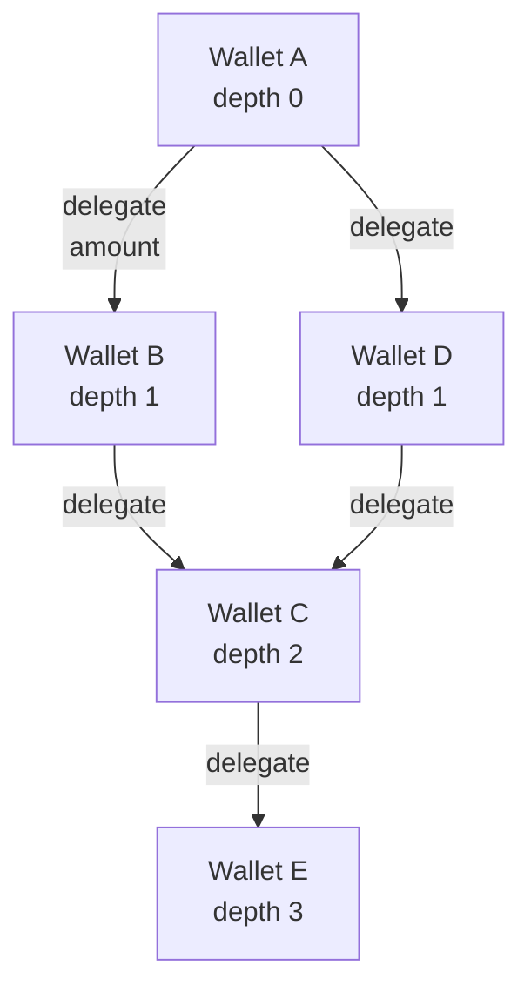

# Delegation Trust

The delegation trust graph is the second pillar of the trust
model. It lets wallets publish **on-chain endorsements** of other
wallets, so a new wallet with no history can inherit trust from
its sponsors.

Implemented in `src/delegation.ts`. The on-chain state lives in
`registry.teal` — see [../architecture/smart-contracts.md](../architecture/smart-contracts.md).

## 1. Overview



A's trust depends on B and D; B and D depend on C; C depends on E.
The graph is traversed BFS to compute depth, sponsor count,
sponsor quality, and delegated amount.

## 2. Formula

```
delegationTrustScore = Σ (weight_i × score_i) / Σ weight_i
```

| Component | Weight | Source |
|-----------|-------:|--------|
| Depth | 0.25 | `computeDepthScore(depth)` |
| Sponsor quality | 0.30 | `computeSponsorQualityScore(avgQuality)` |
| Sponsor count | 0.25 | `computeSponsorCountScore(count, avgQuality)` |
| Amount | 0.20 | `computeAmountScore(amountMicroAlgo)` |

## 3. Sub-Scores

### 3.1 Depth Score (`computeDepthScore`)

Depth 0 (no sponsors) returns 0. The score decreases monotonically
with depth.

```
if depth === 0: return 0
if depth >= 7:  return 0
return 100 - (depth - 1) × 20
```

| Depth | Score |
|------:|------:|
| 1 | 100 |
| 2 | 80 |
| 3 | 60 |
| 4 | 40 |
| 5 | 20 |
| 6 | 0 (clamped from −20) |
| 7+ | 0 |

Trust **cannot increase through depth alone**. Each hop costs 20
points.

### 3.2 Sponsor Quality Score (`computeSponsorQualityScore`)

The average trust score of all sponsors, weighted by depth.

```
avgQuality = Σ (sponsorTrust × depthWeight) / Σ depthWeight
depthWeight(d) = 1 / d
```

Depth 1 sponsors are weighted 1.0, depth 2 sponsors 0.5, etc. A
wallet that is sponsored by one high-quality depth-1 sponsor
outscores one sponsored by ten low-quality depth-5 sponsors.

### 3.3 Sponsor Count Score (`computeSponsorCountScore`)

Counts unique sponsors with a quality gate. This is the **key
anti-amplification** sub-score.

```
score(count, avgQuality) = sqrt(count) × (avgQuality / 100) × 40
clamped to [0, 100]
```

Two effects:

- **Quality gate** — sponsors with `avgQuality < 30` are not
  counted at all. (Filtering happens before this function.)
- **Sub-linear count** — `sqrt(count)` prevents trust inflation
  from many low-quality sponsors. 4 sponsors of quality 50 give the
  same score as 1 sponsor of quality 100.

### 3.4 Amount Score (`computeAmountScore`)

Log-scale on microAlgo.

```
if amount <= 0:  return 0
if amount >= 1e15: return 100  // 1M ALGO
return (log10(amount) / 15) × 100
```

| Amount (ALGO) | Score |
|--------------:|------:|
| 1 000 | 30 |
| 10 000 | 40 |
| 100 000 | 50 |
| 1 000 000 | 60 |
| 10 000 000 | 70 |
| 100 000 000 | 80 |
| 1 000 000 000 | 90 |

Diminishing returns prevent whale domination. 10K ALGO and 100K
ALGO differ by only 10 points.

## 4. Trust Amplification Prevention

The "CAP" comment at `src/delegation.ts:21-50` captures the design
rationale:

> **CAP: Trust cannot exceed the highest sponsor trust score.**
>
> For a wallet at depth d+1 sponsored by wallets at depth d, the
> delegation trust score is bounded by the maximum trust score of
> any depth-d sponsor. This prevents relative amplification: a
> sponsor of trust 70 cannot create a delegatee of trust 75.

### Mathematical proof

For wallets A (depth d+1) and B (depth d) with the same sponsor
quality Q:

```
Raw_A - Raw_B = -7 + 0.12Q
Cap_A = Q - (d+1) × 20
Cap_B = Q - d × 20
```

For d ≥ 1: `Cap_A = Q - 40 < Q - 7 ≤ trustScore(B)`, therefore
`trustScore(A) < trustScore(B)`. ✓

### Why this works

- Each hop costs 20 points of cap.
- A 70-trust wallet can have a delegatee of at most 50 trust (at
  depth 1) or 30 trust (at depth 2).
- This is the **relative** bound — a delegatee cannot exceed any
  of its direct sponsors.

## 5. Cycle Detection

A BFS with a visited set prevents cycles from increasing depth or
count. Each node is visited exactly once.

```typescript
const visited = new Set<string>();
const queue: [string, number][] = [[root, 0]];  // [address, depth]

while (queue.length > 0) {
  const [current, depth] = queue.shift()!;
  if (visited.has(current)) continue;
  visited.add(current);
  // ... process node, enqueue neighbours
}
```

The visited set is per-request; it is not persisted.

## 6. Graph Traversal Complexity

From `src/lib/graph.ts:14-19`:

| Function | Complexity |
|----------|-----------|
| `buildAdjacencyList` | O(E) |
| `computeClusteringCoefficient` | O(k²) per node, O(E × d) batch |
| `computeHubScore` | O(1) per node |
| `computeIntermediateDensity` | O(k² × d) per node |
| `bfs` | O(V + E) with index-based dequeue |
| `findConnectedComponents` | O(V_sub + E_sub) constrained BFS |
| `computeTemporalCorrelation` | O(V² × R) |
| `computeGraphSignals` | O(E × d + V × k² × d + V² × R) |

Where V = vertices, E = edges, k = average degree, d = max depth,
R = round range. The BFS uses an index-based dequeue (O(1) shift)
rather than Array.shift (O(n)).

## 7. Design Decisions

### Why depth-attenuated cap, not hard cap?

A hard cap (`trust = max(sponsorTrust)`) would prevent legitimate
multi-hop trust networks. The depth-attenuated cap
(`trust = max(sponsorTrust) - depth × 20`) allows multi-hop
networks but ensures each hop is strictly worse than the
predecessor.

### Why log scale on amount?

Linear amount scaling lets a single 1M-ALGO delegation dominate
the score. Log scale treats 10K and 100K the same (10-point
difference) so whale delegations cannot game the system.

### Why BFS, not DFS?

BFS is bounded by depth and produces the shortest path. DFS would
traverse the longest paths first and risk stack overflow on
malicious deep graphs.

## 8. Known Limitations

- **Indexer page limit.** The BFS reads at most
  `MAX_TRANSACTION_PAGES × INDEXER_PAGE_SIZE = 1 000`
  transactions per wallet. A wallet with > 1 000 axfer transactions
  is traversed on a subset.
- **No temporal weighting.** Older delegations count the same as
  recent ones. A sponsor who delegated 6 months ago and has since
  lost trust still contributes to the count.
- **No sponsor count cap.** A wallet with 100 high-quality
  sponsors still scores higher than one with 10. This is a
  deliberate choice — a popular wallet is a positive signal — but
  the `sqrt` term already provides diminishing returns.

## 9. Attack Vectors and Mitigations

| Attack | Mitigation |
|--------|-----------|
| Trust amplification via sybil | `computeSponsorCountScore` quality gate + `sqrt(count)` |
| Depth amplification | `cap = max(sponsorTrust) - depth × 20` |
| Circular delegation | BFS with visited set |
| Whale delegation | `computeAmountScore` log scale |
| Sponsor fraud (delegator lies) | Sybil detection (see [sybil-detection.md](sybil-detection.md)) |

## 10. See also

- [sybil-detection.md](sybil-detection.md) — 12 sybil signals
- [trust-scoring.md](trust-scoring.md) — composite trust score
- [credit-and-underwriting.md](credit-and-underwriting.md) — the
  decision engine that uses delegation trust
- [../architecture/smart-contracts.md](../architecture/smart-contracts.md) —
  `registry.teal` storage format and method signatures
- [../security/threat-model.md](../security/threat-model.md) §
  Delegation trust security
