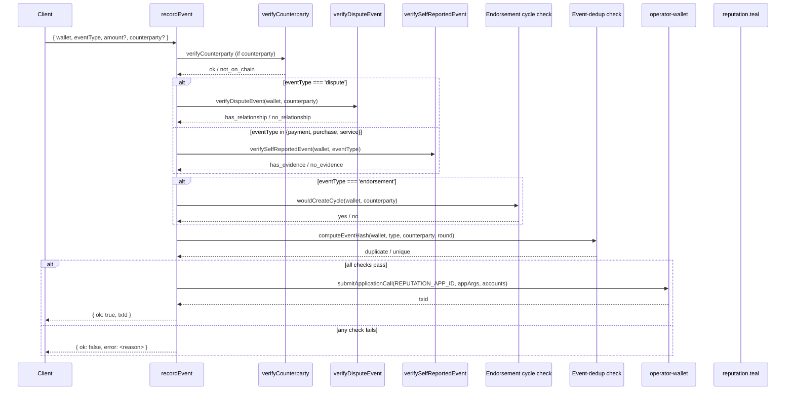

# Reputation

The reputation subsystem records observable behaviour events
(`payment`, `purchase`, `dispute`, `refund`, `endorsement`,
`service`) for a wallet, with a 0–100 reputation score derived
from the weighted sum of those events.

Implemented in `src/reputation.ts`. The on-chain state lives in
`reputation.teal` — see [../architecture/smart-contracts.md](../architecture/smart-contracts.md).

## 1. Event types and weights

```typescript
type EventType = 'payment' | 'purchase' | 'dispute' | 'refund' | 'endorsement' | 'service';

const EVENT_WEIGHTS: Record<EventType, number> = {
  payment:     10,
  purchase:     8,
  dispute:     20,  // negative
  refund:      -8,  // negative
  endorsement:  8,  // was 15, see § F2 FIX below
  service:      5,
};
```

The on-chain encoding is a single character per event type:

| Event type | On-chain char |
|------------|:-------------:|
| `payment` | `p` |
| `purchase` | `u` |
| `dispute` | `d` |
| `refund` | `r` |
| `endorsement` | `e` |
| `service` | `s` |

`EVENT_TYPE_MAP` in `src/reputation.ts:14-22` is the
single-source-of-truth for this mapping.

## 2. F1 — Counterparty verification

When `recordEvent` is called with a `counterparty`, the service
verifies the counterparty is a real on-chain wallet (F1 audit fix).
`verifyCounterparty` at `src/reputation.ts:529`:

```typescript
const info = (await withTimeout(
  algod.accountInformation(counterparty).do(),
  5_000,
  'accountInformation',
)) as { createdAtRound?: number };
return (info.createdAtRound ?? 0) > 0;
```

If the counterparty is not on chain, the event is recorded with
`counterpartyVerified: false` and the underwriting layer should
treat it with reduced confidence.

## 3. F2 — Endorsement weight reduction

The endorsement weight was reduced from 15 → 8 in the F2 audit
fix. The original weighting allowed cheap endorsement farming:

```
Original:
  5 wallets × 0.1 ALGO cost = 0.5 ALGO → 75 reputation points

Fixed:
  5 wallets × 0.1 ALGO cost = 0.5 ALGO → 40 reputation points

Impact: endorsement farming ROI reduced by 47%.
```

## 4. F5 — Dispute verification

`dispute` events must have **on-chain proof of a relationship**
between the disputing wallet and the counterparty.
`verifyDisputeEvent` at `src/reputation.ts:546` queries the
indexer for transactions between the two wallets:

```typescript
const res = await withTimeout(fetch(url, { signal: AbortSignal.timeout(5000) }), ...);
const data = (await res.json()) as DisputeResponse;
const txns = data.transactions || [];

return txns.some((t) => {
  const sender = t.sender || '';
  const receiver = t['payment-transaction']?.receiver ||
                   t['asset-transfer-transaction']?.receiver || '';
  return (sender === wallet && receiver === counterparty) ||
         (sender === counterparty && receiver === wallet);
});
```

If no on-chain relationship exists, the dispute is rejected at
`recordEvent` time (returns `null`).

## 5. Self-report verification

`payment`, `purchase`, and `service` events are self-reported.
The service verifies each has on-chain evidence (P1 audit fix).
`verifySelfReportedEvent` at `src/reputation.ts:601`:

```typescript
if (eventType === 'payment' || eventType === 'purchase') {
  return txns.some((t) => !!t['payment-transaction'] || !!t['asset-transfer-transaction']);
}
if (eventType === 'service') {
  return txns.some((t) => t['tx-type'] === 'appl');
}
```

A self-reported event without on-chain evidence is recorded with
`counterpartyVerified: false` and applies 0.5× weight in the
underwriting engine.

## 6. Endorsement cycle detection (5-deep BFS)

A wallet cannot endorse itself (sponsor ≠ agent in
`registry.ts:63`). The reputation subsystem also detects
**endorsement cycles** to prevent circular trust rings.

`endorsementGraph` at `src/reputation.ts:172` is an in-memory
`Map<wallet, Set<endorsed>>`. On each `recordEvent`, the service
walks the endorsement graph up to 5 hops from the counterparty
and rejects the event if the wallet would be its own ancestor.

```typescript
function wouldCreateCycle(root: string, target: string, depth = 5): boolean {
  if (depth === 0) return false;
  if (root === target) return true;
  const neighbours = endorsementGraph.get(root);
  if (!neighbours) return false;
  for (const n of neighbours) {
    if (wouldCreateCycle(n, target, depth - 1)) return true;
  }
  return false;
}
```

`endorsementGraph` is process-local; in a multi-replica
deployment, cycles can be detected on one replica but not another.
The on-chain `update_admin` rotation does not help here; a full
multi-replica cycle-detection would need a shared store.

## 7. Event deduplication

`computeEventHash` at `src/reputation.ts:88`:

```typescript
eventHash = sha256(`${wallet}:${type}:${counterparty}:${round}`)
```

The hash is keyed in a 10 000-entry, 1-hour-TTL LRU
(`eventDeduplicationStore`). A duplicate event within 1 hour is
rejected (returns `null`).

## 8. Reputation score

`computeReputation(wallet)` at `src/reputation.ts` aggregates the
on-chain events for a wallet:

```
reputation = Σ (event_count_i × weight_i × sign_i) / maxReputation × 100
```

Where `sign` is `+1` for positive events, `-1` for
`dispute`/`refund`, and `maxReputation` is the highest observed
reputation in the system. The result is clamped to `[0, 100]`.

## 9. Public API

```typescript
// src/reputation.ts
export async function recordEvent(input: {
  wallet: string;
  eventType: EventType;
  amount?: number;
  counterparty?: string;
}): Promise<{ ok: boolean; txId?: string; error?: string }>;

export async function computeReputation(wallet: string): Promise<{
  reputation: number;
  riskLevel: 'low' | 'medium' | 'high' | 'critical';
  confidence: number;
  totalEvents: number;
  factors: ReputationFactor[];
  explanation: string[];
}>;
```

The HTTP surface is `POST /reputation/record` and `GET /reputation`.
See [../api/README.md](../api/README.md).

## 10. Lifecycle of an event



## 11. Multi-replica

| State | Persisted? | Multi-replica behavior |
|-------|------------|------------------------|
| On-chain box storage (`reputation.teal`) | Yes (Algorand) | Consistent |
| `endorsementGraph` (in-memory) | No | Per-replica; cycles may be detected on one replica and not another |
| `eventDeduplicationStore` (in-memory LRU, 1h TTL) | No | Per-replica; an event rejected on one replica can be accepted on another |

For strict consistency across replicas, back the in-memory state
with Redis or a SQL store.

## 12. See also

- [trust-scoring.md](trust-scoring.md) — composite trust score
- [delegation.md](delegation.md) — delegation trust graph
- [credit-and-underwriting.md](credit-and-underwriting.md) — the
  decision engine that uses reputation
- [../architecture/smart-contracts.md](../architecture/smart-contracts.md) —
  `reputation.teal` storage format and method signatures
- [../security/threat-model.md](../security/threat-model.md) §
  Reputation event validation
