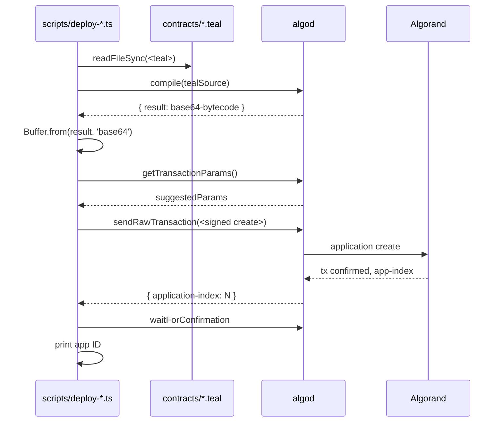

# Smart Contract Authoring Guide

This guide covers the two Algorand stateful contracts in
`contracts/`, the deploy flow, and the wire encoding for
application arguments.

See [../architecture/smart-contracts.md](../architecture/smart-contracts.md)
for the full reference. This page is the **how-to-write-or-modify
a contract** companion.

## 1. The two contracts

| File | Purpose | Box layout | Global state |
|------|---------|------------|--------------|
| `contracts/registry.teal` | Delegation registry | `"del:" + delegator + delegatee` → `amount + timestamp` | `admin`, `total_delegations` |
| `contracts/reputation.teal` | Reputation events | `"rep:" + wallet + ":" + typeChar` → `count + total_amount` | `admin`, `total_events` |

Both use `#pragma version 10`.

## 2. Tooling

The service does **not** ship a local TEAL evaluator. Contracts are
compiled at deploy time by `algod.compile` over the deployed
algod endpoint. This means:

- No local `goal` binary is required
- Compilation is reproducible (same source, same algod version,
  same bytecode)
- Compile errors surface as `400` from `algod.compile` and are
  logged

## 3. Deploy flow



The `makeApplicationCreateTxnFromObject` call sets:

| Field | `registry.teal` | `reputation.teal` |
|-------|-----------------|------------------|
| `numGlobalByteSlices` | 1 (`admin`) | 1 (`admin`) |
| `numGlobalInts` | 1 (`total_delegations`) | 1 (`total_events`) |
| `numLocalByteSlices` | 0 | 0 |
| `numLocalInts` | 0 | 0 |

`globalStateSchema` and `localStateSchema` are deliberately
minimal — most state goes in **box storage**.

## 4. App args layout

The service uses a uniform pattern: **first arg is the method
name (string)**, subsequent args are `uint64` (encoded with
`algosdk.encodeUint64`).

### `add_delegation` (registry.teal)

```typescript
const appArgs: Uint8Array[] = [
  new TextEncoder().encode('add_delegation'),
  algosdk.encodeUint64(Math.floor(amount)),
];
const accounts = [agent];
```

`accounts` is the **foreign-accounts array** — Algorand requires
this for box reads to reference accounts outside the transaction
sender.

### `revoke_delegation` (registry.teal)

```typescript
const appArgs: Uint8Array[] = [
  new TextEncoder().encode('revoke_delegation'),
];
const accounts = [agent];
```

### `record` (reputation.teal)

```typescript
const eventTypeChar = EVENT_TYPE_MAP[eventType];  // 'p', 'u', 'd', 'r', 'e', 's'
const appArgs: Uint8Array[] = [
  new TextEncoder().encode('record'),
  algosdk.encodeUint64(wallet),
  new TextEncoder().encode(eventTypeChar),
  algosdk.encodeUint64(Math.floor(amount)),
];
```

The contract validates `eventTypeChar ∈ {p, u, d, r, e, s}` and
rejects anything else.

## 5. Box storage patterns

Both contracts use box storage for per-record state. The
characteristics:

- **Box key:** arbitrary bytes (we use strings + 32-byte Algorand
  addresses)
- **Box value:** arbitrary bytes (we use 8+8 = 16 bytes for
  `(uint64, uint64)`)
- **MBR:** 0.1 ALGO per box; the service funds the contract
  account with 0.1 ALGO at deploy time
- **Read cost:** 1 read opcode per 1KB
- **Write cost:** 1 write opcode per 1KB + box-creation cost

### Why boxes, not global state?

Global state is limited to 64 KV-pairs per app (32 bytes + 64
uint64). The registry needs O(wallets × sponsors) entries, the
reputation needs O(wallets × eventTypes) entries. Box storage scales
to O(creators × writers), with MBR funded by the user.

## 6. The 16-byte value encoding

Both contracts use a 16-byte value: `count (8 bytes) + total (8
bytes)`. The TEAL uses `btoi` on the first and second 8-byte
chunks:

```
// Read count
int 0
int 8
box_get
btoi
// → count

// Read total
int 8
int 8
box_get
btoi
// → total
```

The JS side writes the value as:

```typescript
const value = new Uint8Array(16);
encodeUint64(count, value, 0);     // first 8 bytes
encodeUint64(total, value, 8);     // next 8 bytes
box_put(key, value);
```

## 7. Admin rotation

Both contracts expose an admin-only `update_admin` (or equivalent)
method. To rotate:

```python
# Pseudocode — not exposed by the service; call directly
from algosdk import mnemonic, transaction, logic
sk = mnemonic.to_secret_key(new_admin_mnemonic)
sp = algod.suggested_params()
txn = transaction.ApplicationCallTxn(
    sender=current_admin,
    sp=sp,
    index=app_id,
    on_complete=transaction.OnComplete.NoOpOC,
    app_args=[b"update_admin", encode_uint64(new_admin_addr)],
)
signed = txn.sign(sk)
txid = algod.send_transaction(signed)
algod.wait_for_confirmation(txid, 4)
```

The service does **not** expose `update_admin` over HTTP. Operators
must call it directly via the SDK.

## 8. Authoring checklist

When adding a new method to a contract:

1. **Document the wire encoding** in this file and in
   [../architecture/smart-contracts.md](../architecture/smart-contracts.md)
2. **Update `src/registry.ts` or `src/reputation.ts`** to send the
   new app args
3. **Update `src/lib/operator-wallet.ts`** if the method has
   special timeouts
4. **Add a route** in `src/app.ts` if the method is HTTP-exposed
5. **Update `docs/api/openapi.yaml`**
6. **Add a unit test** for the new method (TEAL compilation cannot
   be unit-tested; test the JS side that calls it)
7. **Add a CHANGELOG entry**

## 9. Security checklist

- Every state-modifying method must check the caller is the admin
  (`txn Sender == global admin`)
- Every box-write must validate the box size before writing
  (Algorand MBR)
- Every method that accepts `uint64` args must reject negative
  values
- The contract must compile with `#pragma version 10` (or
  whichever version the running algod supports)
- The contract must not loop unbounded (algod rejects loops over
  a budget)
- The contract must be small enough to audit line by line —
  aim for < 500 lines

## 10. See also

- [../architecture/smart-contracts.md](../architecture/smart-contracts.md) —
  full reference
- [../security/operator-wallet.md](../security/operator-wallet.md) —
  how the runtime submits transactions
- [../operations/environment-variables.md](../operations/environment-variables.md) §
  Smart contracts
- [../security/threat-model.md](../security/threat-model.md) §
  Smart-contract trust assumptions
